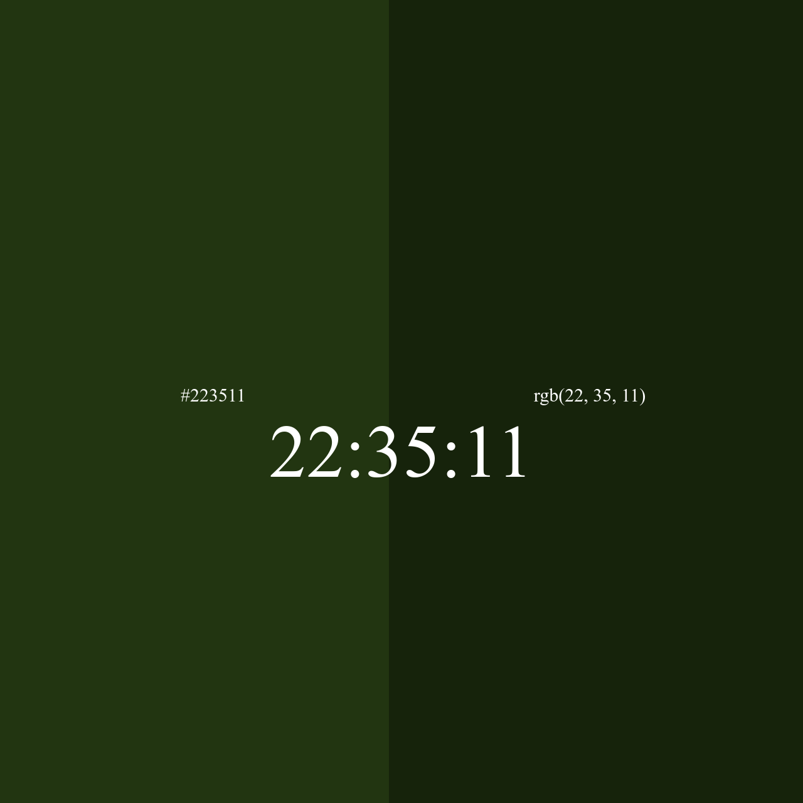

# HEX And RGB Clock

This project displays a real-time clock alongside its corresponding color values. The current time is used to generate both a hexadecimal color code and an RGB color, which are dynamically displayed on the webpage. The page is split into two sections, each with its respective color format, and the clock time is shown prominently in the center.

## Features
- **Real-Time Clock**: The clock displays the current time in the format `hh:mm:ss`, which updates every second.
- **Hexadecimal and RGB Color Updates**: The background colors for each side of the page are updated every second based on the current time, shown as both a hexadecimal value and an RGB value.

## Files
- **index.html**: Contains the basic structure of the webpage and references the CSS and JavaScript files.
- **style.css**: Styles the page, divides it into two halves for displaying the hexadecimal and RGB values, and sets the positioning for the clock.
- **script.js**: Includes the JavaScript code responsible for dynamically updating the time, hexadecimal value, RGB value, and the corresponding background colors.

## Technologies Used
- **HTML5**: For the structure and layout of the webpage.
- **CSS3**: To style the webpage, manage the layout of different sections, and format the clock display.
- **JavaScript**: To fetch the current time, compute the corresponding hexadecimal and RGB color values, and update the page dynamically.

## Screenshot

## License
This project is open-source and available under the MIT License.

